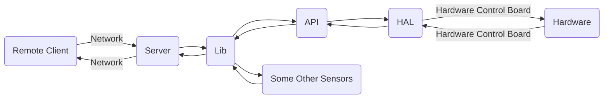

# Commodore Remote Flight Control System
[中文](README.md)  
Commodore is an asynchronous, socket-based, graphical lightweight remote flight network control system implemented using Python and SDL.  
> Note: This program is still immature.

## Requirements
Please ensure your aircraft meets the following conditions:  
1. The onboard controller has a Python 3.8 or higher runtime environment. Although this program is cross-platform (but does not support micropython), it is still recommended to run it on Linux or Android (Termux).  
2. The onboard controller has an uninterrupted network connection during flight, as this program controls the aircraft based on the network.  
3. The onboard controller can control the aircraft's control surfaces and engines.  
4. The onboard controller system has a public IP address or a configured intranet penetration service.  
5. The onboard controller has a camera (optional).  
    
Recommended materials:
- Arduino UNO compatible development board, connecting the serial port to the Redmi 2 phone serial port to transfer data.  
- Redmi 2 phone, soldering the serial port, flashing the LineageOS aarch64 system, installing Termux and termux-api, termux-boot, and Python, and using Magisk to root the phone.
- An IoT SIM card, inserted into the phone slot, for the controller's network connection.
- Connect the ESC, servos, and Arduino's `~` marked interface according to the Arduino HAL settings, and set up the power supply.

Please ensure you meet the following conditions:  
1. Ample time.  
2. Ability to write (rewrite) hardware-related control APIs.  
3. Not afraid of crashes.

## Directory Structure
/client: Client, including CLI and GUI clients.  
/server: Server.  
/server/dummy_all: Dummy server support files (a fake data returner suitable for debugging development, with a Tkinter GUI tuner, including API and Lib).  
/server/arduino_api: API data sending layer compatible with Arduino, distinguished from HAL, will be explained in the design structure.  
/server/termux_lib: Onboard control library for Android Termux.  
/hal: Hardware compatibility layer, usually compiled and burned separately.  
/hal/arduino: Hardware control program for Arduino.  
/docs: Documentation.

## Design Structure


## Quick Start
`host.py` and `host_*.py` files are the server, loaded on the aircraft's control system.  
`client*.py` files and the `src` directory are the client, running on the local computer.  
`dummy*.py` files are the dummy environment, a simulated aircraft program running on the local computer. Install dependencies before running the program.  
To run the server:  
```bash
python3 host.py
```
To run the graphical client (requires a graphical environment):  
```bash
python3 client_gui.py
```
To run the command-line client (cannot view the camera, commands are called via JSON):  
```bash
python3 client_cli.py
```
To run the dummy environment:  
```bash
python3 dummy.py
```