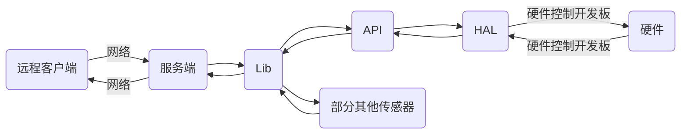

# Commodore 远程飞行控制系统
[English](README.en.md)  
Commodore 是一个使用 Python 与 SDL 实现的, 异步的, 基于 socket 的图形化的轻量级远程飞行网络控制系统  
> 注意: 此程序尚不成熟

## 运行条件
请确保你的飞行器符合以下条件:  
1. 板载控制器具有 Python 3.8 及以上的运行环境, 尽管此程序是跨平台(但不支持micropython)的, 仍然建议用 Linux 或 Android(Termux) 运行  
2. 飞行过程中板载控制器具有不间断的网络连接, 因为此程序基于网络来控制飞行器  
3. 板载控制器能控制飞行器的操纵面与引擎  
4. 板载控制器系统有一个公网 IP 地址或有一个配置好的内网穿透服务  
5. 板载控制器有一个摄像头 (可选)  
    
建议的材料:
- Arduino UNO 兼容开发板, 将串口与 Redmi 2 手机串口相连接, 以传输数据  
- Redmi 2 手机, 焊接串口, 刷入 LineageOS aarch64 系统, 装入 Termux 和 termux-api, termux-boot 与 Python, 并使用 Magisk root 手机
- 一张 IoT sim 卡, 插入手机卡槽中, 用于控制器的网络连接
- 按照 Arduino HAL 的设置将电调, 舵机与 Arduino 的 `~` 标记接口相连接, 并设置好电源

请确保您符合以下条件:  
1. 时间充裕  
2. 能手写(改写)硬件相关控制 API  
3. 不怕炸机  

## 目录结构
/client: 客户端, 含有 CLI 与 GUI 客户端  
/server: 服务端  
/server/dummy_all: 傀儡服务端支持文件 (一个适用于调试开发的假数据回传器, 具有一个 Tkinter GUI 调谐器, 包含 API 和 Lib)  
/server/arduino_api: 兼容到 Arduino 的 API 数据发送层, 区分于 HAL, 会在设计结构中说明  
/server/termux_lib: 适用于 Android Termux 的板载控制库  
/hal: 硬件兼容层, 通常单独编译烧写  
/hal/arduino: 适用于 Arduino 的硬件控制程序  
/docs :文档  

## 设计结构


## 快速开始
`host.py` 与 `host_*.py` 文件是服务端, 装载于飞行器的控制系统.  
`client*.py` 文件与 `src` 目录是客户端, 在本地计算机上运行.  
`dummy*.py` 文件是傀儡环境, 即运行在本地计算机上的模拟飞行器程序. 运行程序前, 请安装依赖包.  
运行服务端:  
```bash
python3 host.py
```
运行图形化客户端 (需要图形环境):  
```bash
python3 client_gui.py
```
运行命令行客户端 (无法查看摄像头, 通过 JSON 调用命令):  
```bash
python3 client_cli.py
```
运行傀儡环境:  
```bash
python3 dummy.py
```
